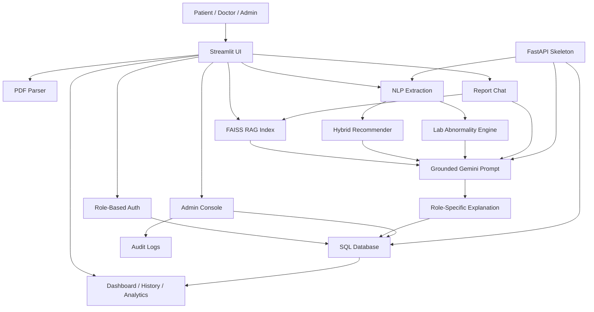

# Architecture

## Modules

- `modules/config.py`: environment, paths, secrets
- `modules/database.py`: SQLAlchemy models and sessions
- `modules/security.py`: password hashing and JWT utilities
- `modules/auth.py`: Streamlit authentication panels
- `modules/nlp.py`: entity and lab value extraction
- `modules/predictor.py`: confidence-ranked dataset recommendations
- `modules/rag.py`: persistent FAISS retrieval
- `modules/llm.py`: grounded Gemini prompts
- `modules/safety.py`: red-flag detection and risk levels
- `modules/visualization.py`: Plotly charts
- `modules/report_service.py`: report persistence, feedback, history, and dashboard metrics
- `modules/privacy.py`: redacts sensitive identifiers before LLM calls
- `api/main.py`: FastAPI backend skeleton
- `api/schemas.py`: Pydantic request/response schemas

## Database Tables

- `users`: accounts, roles, consent
- `reports`: uploaded/manual report analyses
- `diagnoses`: prediction labels, confidence, evidence
- `feedback`: clinician or user feedback
- `audit_logs`: login, registration, report-analysis events
